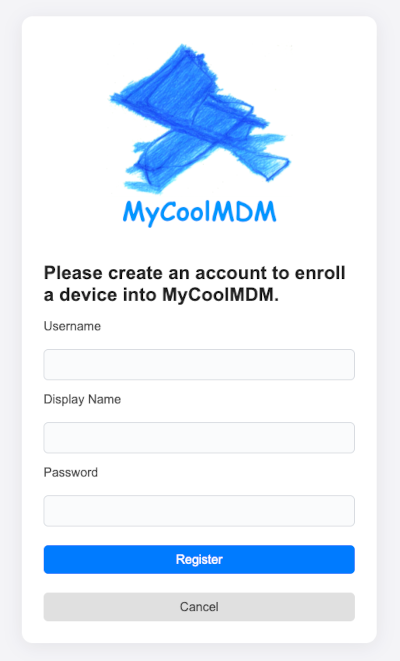
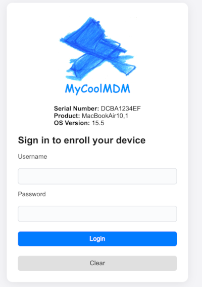
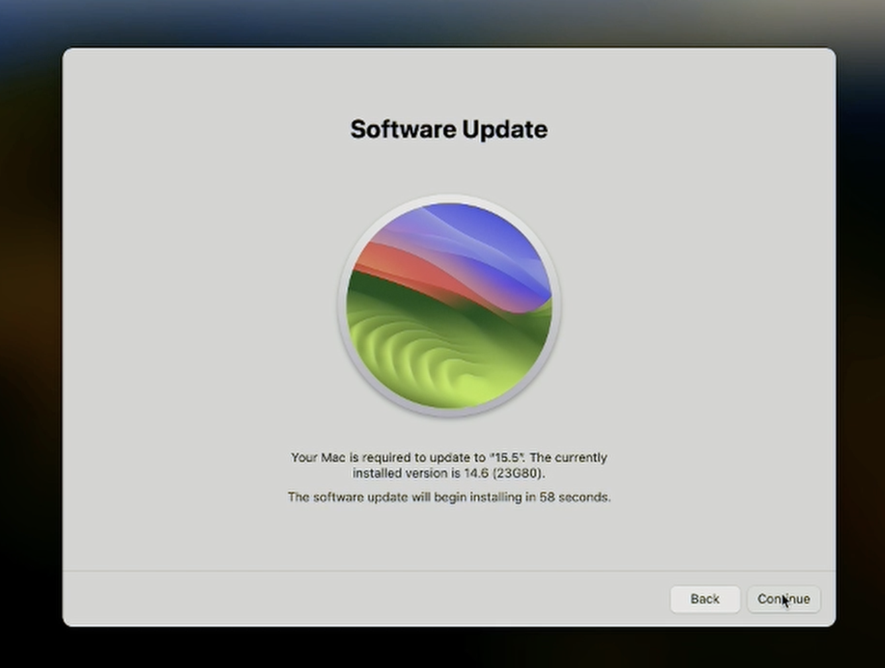
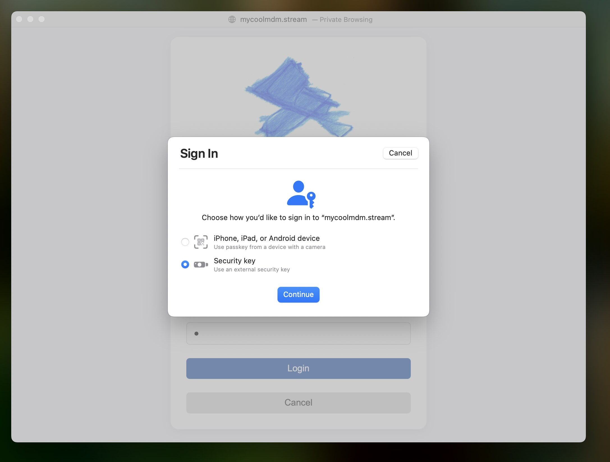
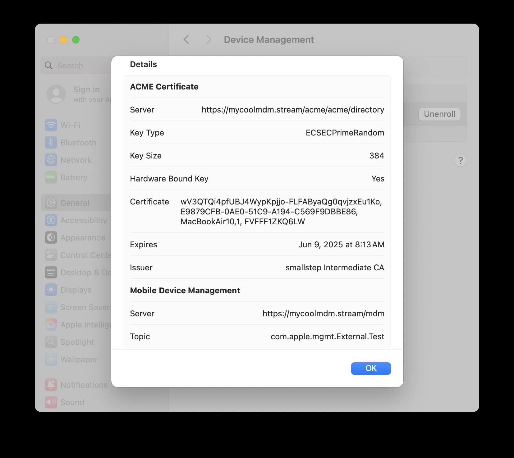
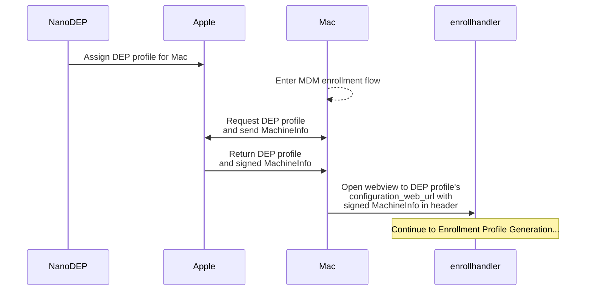
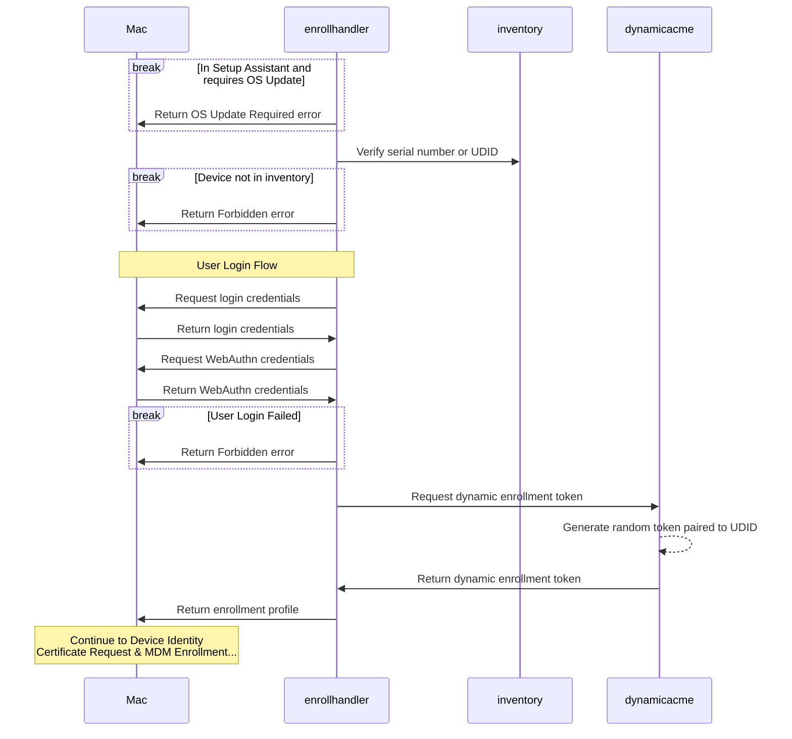
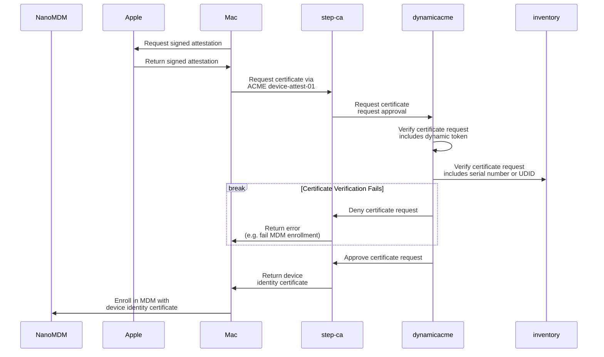

# About

This repo is a companion to the "Securing macOS Enrollments" talk [@korylprince](https://github.com/korylprince/) and [@vdesouza](https://github.com/vdesouza/) gave at [MDOYVR](https://mdoyvr.com/) 2025.

- Video (TBD)
- [Presentation](https://docs.google.com/presentation/d/17gCWyAzPvc7kGWBTa_FeRkfMMZ9nYaBVJDARCzSk7sw/edit?usp=sharing)

This repo demos a macOS MDM that implements the following enrollment security controls:

- [Authenticating Through Web Views](https://developer.apple.com/documentation/devicemanagement/authenticating-through-web-views)
    - Verification of the [`x-apple-aspen-deviceinfo` header](https://developer.apple.com/documentation/devicemanagement/machineinfo)
    - Serial Number/UDID authorization against device inventory
    - User login including WebAuthn
    - Forced OS update during Setup Assistant
- Enrollment security
    - Required use of ACME with [Managed Device Attestation](https://support.apple.com/guide/deployment/managed-device-attestation-dep28afbde6a/web)
    - Dynamic, single-use ACME enrollment tokens

**Warning:** This is a demo, not a product. You should use this for inspiration, not running in production.

# Setting up the Demo

This demo is designed to run on a single-node [k3s](https://k3s.io/) cluster. Follow the steps below to set up your own demo environment.

## Prerequisites

You need to have the following in order to run this demo yourself:

- A linux server instance that meets the [k3s requirements](https://docs.k3s.io/installation/requirements)
- An Internet public IP address assigned or routed to your server
- A public DNS name pointed at the public IP
    - In the rest of this README, replace `cluster.tld` with the DNS domain you're using
    - You should have the following DNS records configured:
        - cluster.tld A <server's public IP>
        - registry.cluster.tld CNAME cluster.tld
        - registry-internal.cluster.tld CNAME cluster.tld
        - dashboard.cluster.tld CNAME cluster.tld

## Initial cluster setup

*Note: unless specified otherwise, run these commands on your local device.*

1. [Install podman](https://podman.io/docs/installation)
1. Install envsubst
    - macOS: `brew install gettext && brew link --force gettext`
    - apt: `apt-get install gettext-base`
    - rpm: `yum install gettext-envsubst`
1. [Install kubectl](https://kubernetes.io/docs/tasks/tools/#kubectl):
1. [Install k3s](https://docs.k3s.io/installation):
    - On your linux server, run:
        - `curl -sfL https://get.k3s.io | sh -`
1.  Port-forward the k8s API port to your local device:
    - `ssh -L 6443:localhost:6443 user@yourserver.tld`
    - Keep this connection open to use kubectl locally, or use `k3s kubectl ...` directly on your server
1. Copy kubectl config to your local device
    - Copy `/etc/rancher/k3s/k3s.yaml` from your server to `~/.kube/config` on your local device
1. Verify kubectl connectivity:
    - `kubectl get pods -A` should return several running pods

## Install dependencies

```bash
INGRESS_HOST="cluster.tld" ./apply-cluster.sh
```

*Note: you may need to run this script a few times to fully set up all cluster resources.*

This command installs the following components:

- [password-generator.yaml](./k8s/cluster/operators/password-generator.yaml)
    - Installs [a k8s operator](https://github.com/mittwald/kubernetes-secret-generator) that generates secrets (passwords, basic auth credentials, etc)
- [replicator.yaml](./k8s/cluster/operators/replicator.yaml)
    - Installs [a k8s operator](https://github.com/mittwald/kubernetes-replicator) that replicates secrets between namespaces (to share certificates and passwords between namespaces)
- [traefik.yaml](./k8s/cluster/operators/traefik.yaml)
    - Configures the [built-in Traefik Ingress controller](https://docs.k3s.io/networking/networking-services#traefik-ingress-controller) to use the real client IPs and adds http-redirection and internal-only middleware
- [cert-manager.yaml](./k8s/cluster/operators/cert-manager.yaml)
    - Installs [a k8s operator](https://cert-manager.io/) that supports generating PKI (CAs, certs, etc) including from Let's Encrypt
- [cert-issuer.yaml](./k8s/cluster/resources/cert-issuer.yaml)
    - Configures a Let's Encrypt cert-manager issuer and HTTPS certificate for cluster services
- [registry.yaml](./k8s/cluster/services/registry.yaml)
    - Installs a container registry to the cluster for private container image hosting
- [dashboard.yaml](./k8s/cluster/services/dashboard.yaml)
    - Installs [Kubernetes Dashboard](https://github.com/kubernetes/dashboard)
    - To access:
        - Run `kubectl -n dashboard create token admin` and copy token
        - Visit https://dashboard.<cluster.tld>
        - Enter token in login box

## Build and push demo containers

This demo deploys some services from public container repos (e.g. Docker Hub and ghcr.io), but others are built from code in this repo.

We deployed a private container registry in the cluster above so we can build and push images directly to the cluster (though hosting these in a public container repo works too!).

```bash
INGRESS_HOST="cluster.tld" ./build-containers.sh
```

### Local development

If you make code changes, do the following to build and push the changes:

```bash
INGRESS_HOST="cluster.tld" ./build-containers.sh container_name
```

Where `container_name` is the name of a directory in the root of this repo (e.g. dynamicacme, enrollhandler).

To deploy the new image to the cluster, you must do one of the following:

- Update the image tag:
    - Update `<container_name>/IMAGE_TAG` with a new tag
    - Run `INGRESS_HOST="cluster.tld" ./build-containers.sh container_name`
    - Update corresponding image tag in `k8s/demo/<container_name>.yaml`
    - Run `INGRESS_HOST="cluster.tld" ./apply-demo.sh`
- If you use the same image tag as before, you'll need to run `kubectl rollout restart -n <namespace> deploy/<deploy name>`
    - This requires that ImagePullPolicy is set to Always on the container spec. Otherwise it won't check if the image changed
- Delete the deploy and reapply the yaml:
    - `kubectl delete deploy -n <namespace> <deploy name>`
    - `INGRESS_HOST="cluster.tld" ./apply-demo.sh`

## Deploy services

Now that all of our dependencies are installed and our service containers are built, it's time to deploy all of the services:

```bash
INGRESS_HOST="cluster.tld" ./apply-demo.sh
```

This command installs the following services:

- [ca.yaml](./k8s/demo/ca.yaml)
    - Creates the CA certificate used to sign and verify MDM device identity certificates
    - Note: Smallstep step-ca will create it's own intermediate signing certificate that actually signs the device identity certificates
- [nanodep.yaml](./k8s/demo/nanodep.yaml)
    - Deploys [NanoDEP](https://github.com/micromdm/nanodep) for configuring DEP profiles
    - See the [Configure DEP profiles (NanoDEP)](#configure-dep-profiles-nanodep) section below for more info
- [smallstep.yaml](./k8s/demo/smallstep.yaml)
    - Deploys the [step-ca](https://github.com/smallstep/certificates) server for ACME device attestation and issuance of device identity certificates
- [nanomdm.yaml](./k8s/demo/nanomdm.yaml)
    - Deploys [NanoMDM](https://github.com/micromdm/nanomdm), an MDM server
    - Also deploys a webhook ([nanowebhook](./nanowebhook)) to log device events
- [deviceinventory.yaml](./k8s/demo/deviceinventory.yaml)
    - Deploys the demo [deviceinventory](./deviceinventory) service, an example of an external device inventory
- [dynamicacme.yaml](./k8s/demo/dynamicacme.yaml)
    - Deploys the demo [dynamicacme](./dynamicacme) service, which implements an API endpoint and step-ca webhook for dynamic, single-use ACME enrollment tokens
    - This service also verifies the device with the deviceinventory service
- [enroll.yaml](./k8s/demo/enroll.yaml)
    - Deploys the demo [enrollhandler](./enrollhandler) service, which implements enrollment profile generation and the bulk of demo security controls

# Run the Demo

## Register a User

Visit `https://<cluster.tld>/register` to create a user account with associated WebAuthn credentials.



## Assign DEP profile (NanoDEP)

Follow the NanoDEP docs to [set up your environment](https://github.com/micromdm/nanodep/blob/main/docs/quickstart.md#setup-environment):

```bash
export BASE_URL='https://<cluster.tld>'
export APIKEY=$(kubectl get -n nanodep secrets/api-key --template='{{.data.password | base64decode}}')
export DEP_NAME=mdm
```

Continue following the NanoDEP docs to

- [generate and retrieve the DEP token public key](https://github.com/micromdm/nanodep/blob/main/docs/quickstart.md#generate-and-retrieve-the-dep-token-public-key)
- [download your DEP token](https://github.com/micromdm/nanodep/blob/main/docs/quickstart.md#download-token)
- [decrypt and upload it](https://github.com/micromdm/nanodep/blob/main/docs/quickstart.md#decrypt-tokens)
- [assign devices in the portal](https://github.com/micromdm/nanodep/blob/main/docs/quickstart.md#assign-a-device-in-the-portal)

Now create your DEP profile:

```json
{
  "profile_name": "My Cool MDM",
  "url": "https://<cluster.tld>/mdm/enroll",
  "configuration_web_url": "https://<cluster.tld>/mdm/enroll",
  "is_supervised": true,
  "is_mandatory": true,
  "is_mdm_removable": true,
  "await_device_configured": false,
  "org_magic": "AD5A973D-A4D4-405C-AD4E-7A7EFA5095A6",
  "skip_setup_items": [
    "AppleID",
    "DisplayTone",
    "Privacy",
    "FileVault",
    "iCloudDiagnostics",
    "iCloudStorage",
    "Restore",
    "ScreenTime",
    "Siri"
  ],
  "devices": ["serial1", "serial2"]
}
```

Finally, assign the profile:

```bash
/path/to/nanodep_repo/tools/dep-define-profile.sh /path/to/dep_profile.json

# output:
{"profile_uuid":"EA75919B46644054A32B940C3B8AD094","devices":{"serial1":"SUCCESS","serial2":"SUCCESS"}}
```

**Note:** the default ingress match rule only exposes a limited subset of the [reverse proxy API](https://github.com/micromdm/nanodep/blob/main/docs/operations-guide.md#reverse-proxy), so some of the nanodep tools will return a "404 not found" message. Follow the comments in [nanodep.yaml](./k8s/nanodep.yaml) to fully expose the API.

## Add serial numbers to demo inventory

On the **server**, run for each serial you want to allow:

```bash
echo "<serial>" >> /var/lib/rancher/k3s/storage/pvc*deviceinventory_deviceinventory/inventory.txt
```

## Enroll the device

Run `sudo profiles renew -type enrollment` to trigger an MDM enrollment prompt.



> `x-apple-aspen-deviceinfo` header info can be used for displaying info as well as checking for software update requirements.



> Software update requirement is checked before the log in page is even shown, to ensure that device is on the required version before the user attempts to sign in and enroll.



> Accounts must be secured with security keys as well.



> Verifying hardware bound key is true in enrollment profile.

# How it works

The diagrams below document how each service interacts as a Mac enrolls in the demo MDM.

### Starting the Enrollment




### Enrollment Profile Generation




### Device Identity Certificate Request & MDM Enrollment


